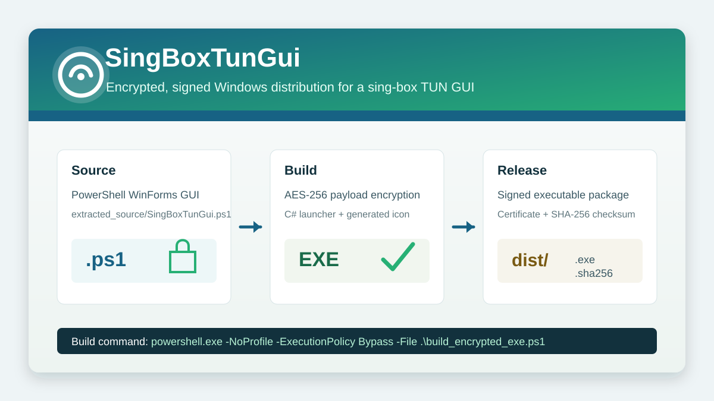

# SingBoxTunGui Encrypted Windows Distribution



## Downloads

- [Download SingBoxTunGui.exe](https://github.com/michele-tn/sing-box-TUN-Controller-PowerShell-GUI-Shadowsocks-VPN-like-Connector-for-Windows/raw/refs/heads/main/BUILD_ENCRYPTED_EXE/dist/SingBoxTunGui.exe)
- [Download SingBoxTunGui.exe.sha256](https://github.com/michele-tn/sing-box-TUN-Controller-PowerShell-GUI-Shadowsocks-VPN-like-Connector-for-Windows/raw/refs/heads/main/BUILD_ENCRYPTED_EXE/dist/SingBoxTunGui.exe.sha256)
- [Download SingBoxTunGui_CodeSigning.cer](https://github.com/michele-tn/sing-box-TUN-Controller-PowerShell-GUI-Shadowsocks-VPN-like-Connector-for-Windows/raw/refs/heads/main/BUILD_ENCRYPTED_EXE/dist/SingBoxTunGui_CodeSigning.cer)

`build_encrypted_exe.ps1` builds a Windows executable distribution for `SingBoxTunGui` from the source PowerShell GUI script located at `extracted_source/SingBoxTunGui.ps1`.

The script is designed to produce a self-contained release folder under `dist/` with:

- `SingBoxTunGui.exe`, a Windows GUI executable launcher.
- `SingBoxTunGui.exe.sha256`, a checksum file compatible with `sha256sum -c`.
- `SingBoxTunGui_CodeSigning.cer`, the public part of the generated code-signing certificate.

## Build Flow

The build process performs the following steps.

1. It resolves all paths relative to the folder containing `build_encrypted_exe.ps1`.
2. It validates that `extracted_source/SingBoxTunGui.ps1` exists.
3. It creates the working folders `build_encrypted/` and `dist/` if they do not already exist.
4. It generates a small `.ico` application icon using .NET drawing APIs.
5. It reads the original PowerShell source script as UTF-8 text.
6. It patches the source script runtime directory detection so that the packaged executable uses the executable folder as the application directory.
7. It encrypts the patched PowerShell script with AES-256-CBC and PKCS7 padding.
8. It embeds the encrypted payload, AES key, and IV into a generated C# launcher source file.
9. It compiles the generated C# launcher with the Windows .NET Framework C# compiler.
10. It signs the generated executable with a local self-signed code-signing certificate.
11. It exports the certificate public key to the distribution folder.
12. It writes a SHA-256 checksum file next to the executable.

## Input Files

The primary input file is:

```text
extracted_source/SingBoxTunGui.ps1
```

This file contains the actual SingBoxTunGui PowerShell/WinForms application. The build script does not modify the source file in place. Instead, it reads the file, applies an in-memory runtime-path adjustment, encrypts the resulting script content, and embeds it into the generated executable launcher.

## Generated Build Files

Intermediate files are written to:

```text
build_encrypted/
```

This folder contains files used during compilation, including:

- `SingBoxTunGui.Loader.cs`, the generated C# launcher source.
- `SingBoxTunGui.ico`, the generated Windows icon.

These files are build artifacts. They can be regenerated by running the build script again.

## Distribution Files

Final release files are written to:

```text
dist/
```

The distribution folder contains:

```text
SingBoxTunGui.exe
SingBoxTunGui.exe.sha256
SingBoxTunGui_CodeSigning.cer
```

`SingBoxTunGui.exe` is the executable launcher. It contains the encrypted PowerShell application payload and starts the GUI through Windows PowerShell at runtime.

`SingBoxTunGui.exe.sha256` contains the SHA-256 checksum in the standard two-space format:

```text
<sha256-hash>  SingBoxTunGui.exe
```

From inside the `dist/` folder, the checksum can be verified with:

```powershell
sha256sum -c SingBoxTunGui.exe.sha256
```

`SingBoxTunGui_CodeSigning.cer` contains the public certificate used to sign the executable.

## Encryption Model

The build script encrypts the PowerShell source payload using:

- AES with a 256-bit key.
- CBC block mode.
- PKCS7 padding.
- A fresh key and IV generated at build time.

The encrypted payload is stored in the generated C# launcher as Base64 chunks. At runtime, the launcher decrypts the payload in memory, writes a temporary PowerShell script to the user temporary directory, and starts Windows PowerShell with that temporary script.

This protects the source script from being stored as plain text inside the executable. It is obfuscation and packaging protection, not a hardware-backed secret. A user with full control of the machine and enough reverse-engineering effort can still inspect a running application.

## Runtime Behavior

When `SingBoxTunGui.exe` starts, the launcher:

1. Decrypts the embedded PowerShell payload.
2. Determines the executable folder and exposes it to the script through `SINGBOXTUNGUI_APPDIR`.
3. Writes the decrypted runtime script to:

```text
%TEMP%\SingBoxTunGui\SingBoxTunGui.runtime.ps1
```

4. Starts Windows PowerShell with:

```text
-NoLogo -NoProfile -ExecutionPolicy Bypass -STA -File <runtime-script>
```

5. Waits for the PowerShell GUI process to exit.
6. Attempts to delete the temporary runtime script.

The `-STA` flag is required because the packaged application uses WinForms.

## Code Signing

The script creates or reuses a self-signed code-signing certificate with this subject:

```text
CN=SingBoxTunGui Local Code Signing
```

The certificate is created in:

```text
Cert:\CurrentUser\My
```

When a new certificate is generated, it is also added to the current user's:

- Trusted Root Certification Authorities store.
- Trusted Publishers store.

The executable is signed with Authenticode using SHA-256. The script fails the build if the resulting signature status is not `Valid`.

The exported `.cer` file contains only the public certificate. It does not contain the private signing key.

## Requirements

The build script expects the following Windows components to be available:

- Windows PowerShell.
- .NET Framework C# compiler, normally located under `C:\Windows\Microsoft.NET\Framework64\v4.0.30319\csc.exe`.
- .NET `System.Drawing` and `System.Windows.Forms` assemblies.
- PowerShell certificate cmdlets such as `New-SelfSignedCertificate`, `Export-Certificate`, and `Set-AuthenticodeSignature`.

## Rebuilding

Run the build script from PowerShell:

```powershell
powershell.exe -NoProfile -ExecutionPolicy Bypass -File .\build_encrypted_exe.ps1
```

After a successful build, the console output lists the executable, checksum file, exported certificate, and signature status.

## Notes

The generated certificate is valid for local signing and local verification. On another machine, Windows may not trust the executable until the exported certificate is imported into an appropriate trusted certificate store.

Security tools may inspect or block executables that decrypt and launch script payloads. If that happens, the certificate, signature, and checksum can help identify the build output, but they do not override endpoint security policy.
